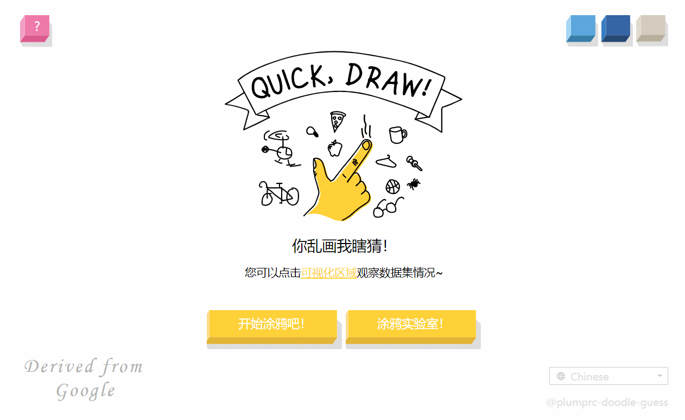

# quickDraw
An imitation of Google's [QuickDraw](https://quickdraw.withgoogle.com/). Draw your sketches and let the model guess them~

## Get Started
1. Install Python>=3.6, PyTorch>=1.1.0.
2. Run `pip install -r requirements.txt`.
3. Download the trained weights from [Google Drive](https://drive.google.com/file/d/1wyurJngyx30Ow6ngow522Jd1PjFXtcJt/view) and put it in `./utils/quickdraw.pth`.
4. Run `python manage.py runserver`.

## Workflow

## Preview
We provide an example canvas in `~:8000/lab/` for you to easily check the data stream. See `./board/static/js/draw.js` for more implementation details.

The main game imitates from Google's QuickDraw (We directly borrowed their art materials =￣ω￣=). See `./board/static/js/main.js` for more implementation details.

